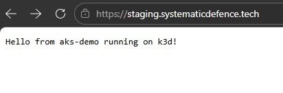
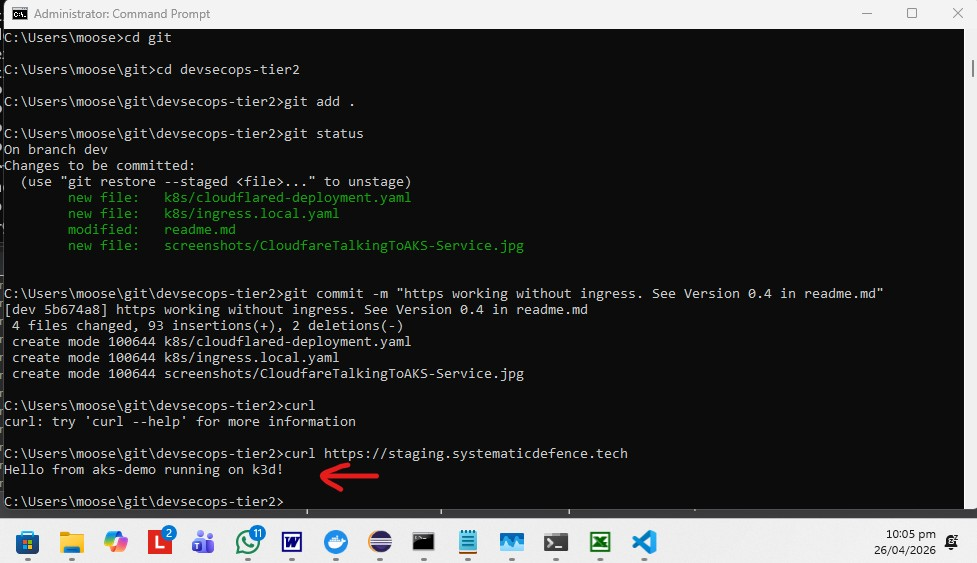

AIM: Towards Azure Kubernetes CI/CD setup.

14 April 2026 - Under Construction

## Version 0.1
19 April 2026 17:00 - Working locally on Docker desktop with:

# local dev

## New Cluster in Windows

a. Create cluster with Load Balancer

<i>Pre req: Launch Docker Desktop.</i>

<i>Assumption: Your Kubernetes setup is running a Service that uses the load balancer.  </i>

i.   [Navigate to your project in powershell]

ii.  Create Kubernetes cluster k3d cluster create aks-local --config k3d-aks-local.yaml

iii. Confirm cluster creation k3d cluster list

iv.  Start cluster 'k3d cluster start [cluster name]'
 

b. Deploy Service on Kubernetes Cluster

i.   cd app

ii.  docker build -t aks-demo:v1 .

iii. cd ..

iv.  k3d image import aks-demo:v1 -c aks-local

v.   kubectl apply -f k8s/deployment.local.yaml

vi.  kubectl apply -f k8s/service.yaml

c. Verify deployment and launch

i. kubectl get pods

ii. kubectl get svc aks-demo-service. 

You should see service type of load balancer. It is a traefik load balancer. You can see it via:

- kubectl get pods -n kube-system | findstr traefik

iv. [Navigate to] http://localhost:8080.

## Existing Cluster

a. Start cluster

<i>Pre req: Open Docker Desktop.</i>

i. Confirm cluster creation by running "k3d cluster list",

ii.  Start cluster 'k3d cluster start [cluster name]',

b. Verify deployment and launch

i. kubectl get pods

ii. kubectl get svc aks-demo-service. You should see service type of load balancer. It is a traefik load balancer. You can see it via:

- kubectl get pods -n kube-system | findstr traefik

iv. [Navigate to] http://localhost:8080.

## Version 0.2
19 April 2026 19:37 - Pre-req is creating an Azure Container Registry (ACR) and an Azure Kubernetes Cluster (containing the ACR). First attempt at CICD AKS. 

## Version 0.3
24 April 2026 16:36 - Kubernetes working locally with k3d's Traefik load balancer. Steps to setup have been documented in Readme.md file under heading 'local dev'.  

### Version 0.3.1
24 April 2026 16:39 - Added identification of the load balancer as a 'traefik' one - automatically generated in k3d.

## Version 0.4
26 April 2026 20:12 - Kubernetes working locally with https from domain staging.systematicdefence.tech. It uses the following model:

- Cloudflare → Tunnel → cloudflared → aks-demo-service → Pods

<i>Note: In above case traefik load balancer is being used and ingress is not involved.</i>

Issue is that Azure Kubernetes does not accept traefik loadbalancer, and while this setup  works, but:
•	You bypass Ingress rules
•	You bypass NGINX features
•	You bypass path routing
•	You bypass host routing
•	You bypass TLS termination
•	You bypass rate limiting
•	You bypass WAF rules
•	You bypass rewrite rules

See Annex A for process.

## Version 0.5

Objective: Cloudflare → Tunnel → cloudflared → Ingress → Service → Pods

See Annex A for process.

## Annex A - How to create a connection to Cloudflare

### SUMMARY

STEP 1-6 creates a temporary linux container, in order to create a Cloudflare credentials. This works because Cloudflare requires:

•	A Linux environment

•	A browser login

•	A writable filesystem

A Docker container satisfies all three. Further, since it is outside Kubernetes, Cloudflare allows the JSON to be generated.

### PRE-REQ

a. Cloudflare account exists. 

b. Domain purchased. Domain DNS has been moved to Cloudflare.

c. Target sub domain exists in hosting provider. No A record exists for it in Cloudflare DNS, i.e. staging.systematicdefence.tech  

d. Project structure:

i) Example structure:

k8s/

  cloudflared/

    config.yml

    credentials/

      aa1d965e-63ed-4002-be37-7a659a915cdb.json   # DO NOT COMMIT

      cert.pem                                    # DO NOT COMMIT

  ingress/

    ingress-nginx.yaml

    staging-ingress.yaml

  deployments/

    aks-demo-deployment.yaml

    aks-demo-service.yaml

ii) Add a .gitignore entry:

k8s/cloudflared/credentials/*

### STEP 1 — Run a temporary Linux container on your PC

This container will act like the “Linux VM” but without needing a VM.

a. Run:

docker run -it --name cloudflared-bootstrap ubuntu:22.04 bash

b. Inside the container:

apt update

apt install -y wget curl nano
 
### STEP 2 — Install cloudflared inside the container

wget https://github.com/cloudflare/cloudflared/releases/latest/download/cloudflared-linux-amd64

mv cloudflared-linux-amd64 /usr/local/bin/cloudflared

chmod +x /usr/local/bin/cloudflared

Note: At this point the container hung. So I closed the powershell window, even though the container was still running. I reentered container via following commands on host:

a. [View docker name] docker ps –a

b. [Run docker command, where ‘-it’ is ‘interactive terminal’] docker exec –it cloudflared-bootstrap /bin/bash 

 
### STEP 3 — Authenticate

a. Inside the container, run:

- cloudflared tunnel login

This opens a URL in your host browser.

b. Log in → select your domain. This generates:

/root/.cloudflared/cert.pem
 
### STEP 4 — Create a new connector for your existing tunnel

a. Inside the container, run:

- cloudflared tunnel create staging-connector

This generates:

/root/.cloudflared/<UUID>.json

This is the JSON you need for Kubernetes.

### STEP 5 — Copy the JSON out of the container

From your host:

C:\Users\moose\>: docker cp cloudflared-bootstrap:/root/.cloudflared ./

You now have:

./.cloudflared/<UUID>.json

./.cloudflared/cert.pem

### STEP 6 — Delete the bootstrap container

docker rm -f cloudflared-bootstrap

### STEP 7 - Setup config.yml and docker-compose.yml to create a cloudflare container to host the tunnel

This can be done via CloudFlare routing through exposed ingress or directly through the exposed service. These are difference architectures:

- Ingress: Cloudflare → Tunnel → cloudflared → NGINX Ingress Controller → Services → Pods
- Service: Cloudflare → Tunnel → cloudflared → aks-demo-service → Pods

<i>Note: To get the benefits of Cloudflare, the ingress path is preferred. See Release Version 0.5</i>

#### a) Tunnel uses Service

Place them in the folder where the json credential file is placed. In this case, it is c:/cloudflared. 

Note: In your editor encoding replace <CRLF> with <LF>

##### config.yml

tunnel: <tunnel-id>
credentials-file: /etc/cloudflared/credentials.json

ingress:
  - hostname: staging.systematicdefence.tech
    service: http://aks-demo-service.default.svc.cluster.local:80
  - service: http_status:404

##### docker-compose.yml

version: "3.8"

services:
  cloudflared:
    image: cloudflare/cloudflared:latest
    container_name: cloudflared-tunnel
    restart: unless-stopped
    command: tunnel run
    volumes:
      - ./config.yml:/etc/cloudflared/config.yml
      - ./<tunnel-id>.json:/etc/cloudflared/<tunnel-id>.json
    network_mode: bridge

##### ingress/staging-ingress-via-service.local.yaml

apiVersion: networking.k8s.io/v1
kind: Ingress
metadata:
  name: staging-ingress
spec:
  rules:
  - host: staging.systematicdefence.tech
    http:
      paths:
      - path: /
        pathType: Prefix
        backend:
          service:
            name: aks-demo-service
            port:
              number: 8080

#### b) Tunnel uses Ingress

##### The plan is:

•	Install NGINX Ingress Controller

•	Expose only the Ingress Controller via LoadBalancer

•	All apps sit behind the Ingress

##### Benefit is:

- Cloudflared sends traffic to the NGINX Ingress Controller, not the app. NGINX applies routing rules, TLS, rewrites, etc. So, it is possible to get full AKS parity and more apps can be added without touching cloudflared

Further,  is the standard Production pattern as it leads to zero public exposure, i.e.:

•	NO need for a public LoadBalancer in AKS

•	NO need for a public IP

•	NO need to expose NGINX to the internet

•	NO need to open ports

•	NO need to pay for Azure LB

Your AKS/local cluster becomes 100% private, 0 public IPs and 0 attack surface, as Cloudflare Tunnel becomes the only entry point.

Note: In your editor encoding replace <CRLF> with <LF>

##### ingress/ingress-nginx.local.yml

apiVersion: v1
kind: Namespace
metadata:
  name: ingress-nginx
---
apiVersion: helm.cattle.io/v1
kind: HelmChart
metadata:
  name: ingress-nginx
  namespace: ingress-nginx
spec:
  chart: ingress-nginx
  repo: https://kubernetes.github.io/ingress-nginx
  targetNamespace: ingress-nginx
  version: 4.10.0
  valuesContent: |-
    controller:
      service:
        type: ClusterIP
        
##### ingress/staging-ingress-nginx.local.yaml

apiVersion: networking.k8s.io/v1
kind: Ingress
metadata:
  name: staging-ingress
  namespace: default
  annotations:
    kubernetes.io/ingress.class: nginx
spec:
  rules:
  - host: staging.systematicdefence.tech
    http:
      paths:
      - path: /
        pathType: Prefix
        backend:
          service:
            name: aks-demo-service
            port:
              number: 80

##### config.yml

tunnel: <tunnel-id>
credentials-file: /etc/cloudflared/credentials.json

ingress:
  - hostname: staging.systematicdefence.tech
    service: http://ingress-nginx-controller.ingress-nginx.svc.cluster.local:80
  - service: http_status:404

##### docker-compose.yml

version: "3.8"

services:
  cloudflared:
    image: cloudflare/cloudflared:latest
    container_name: cloudflared-tunnel
    restart: unless-stopped
    command: tunnel run
    volumes:
      - ./config.yml:/etc/cloudflared/config.yml
      - ./<tunnel-id>.json:/etc/cloudflared/<tunnel-id>.json
    network_mode: bridge

### STEP 9 - Deploy cloudflared inside Kubernetes

You could be deploying cloudflared for first time or updating existing:

#### i. New Deployment

Note: Extracted .json from step 4 will be used. 

a. Create secret:

kubectl create secret generic cloudflared-credentials `
  --from-file=credentials.json=k8s/cloudflared/credentials/aa1d965e-63ed-4002-be37-7a659a915cdb.json
  
kubectl create secret generic cloudflared-cert \
  --from-file=cert.pem=k8s/cloudflared/credentials/cert.pem
  

b. Update config.yml and docker-compose.yml in C:\cloudflared (Update the reference to the tunnel id * 3).

c. Create configmap:

kubectl create configmap cloudflared-config --from-file=k8s/cloudflared/config.yml
  
#### ii. Update Existing Deployment

a.  Apply the updated config

- kubectl delete configmap cloudflared-config

- kubectl create configmap cloudflared-config --from-file=k8s/cloudflared/config.yml

- kubectl rollout restart deployment cloudflared
  
You should now hit your app through:

Cloudflare → Tunnel → cloudflared → NGINX → Service → Pods

### STEP 10 - Verify 

a) Check Cloudflared logs:

kubectl logs -f deployment/cloudflared

You should see:

- "Connected to Cloudflare.

- "Proxying tunnel requests to http://ingress-nginx-controller.ingress-nginx.svc.cluster.local:80"

b) Test externally:

curl https://staging.systematicdefence.tech

